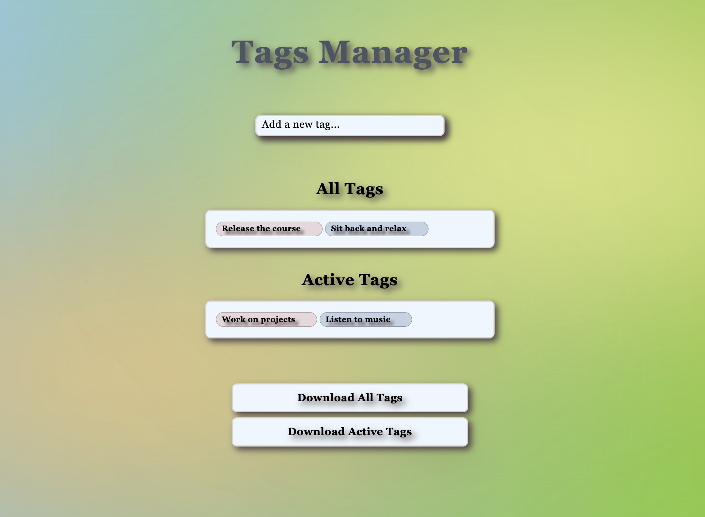

<!--
*** Thank you for reading the Tags Manager README.md file. 
*** Suggestion that would make this better or add/improve a feature please fork the repo and create a pull request.
*** Don't forget to give the project a star! Thanks!
-->

<!-- LOGO -->

<div align="center">
<br />
  <a href="https://github.com/iam-saul">
    
  </a>

  **<h1 align="center">Tags Manager</h1>**

  <p align="center">
    A Great Tags Manager to Keep Track of Your Tags
    <br />
  </p>
  <br />
</div>

<!-- ABOUT THE PROJECT -->
# About The Project

<div align="center">
  <a href="https://github.com/iam-saul/tags-manager">
    
  </a>
  <p align="center">The project Tags Manager entails the use of tags to organize/track them within two categories.
</p>
<br />
<br />
</div>

# Built With

<div align="center">
  
  
  <br />

  
  <br />
  <br />
</div>

# Installation

1. Clone the repo
   ```sh
   git clone https://github.com/iam-saul/tags-manager.git
2. Download repo
    ```sh
    You can always download the .zip file
   ```
<br />
   
# Usage

Tags Manager is used to add and organize tags into two categories, "All Tags" and "Active Tags." Within each category you can edit tags, delete tags by clicking on the tag and deleting the tag name then clicking outside the tag category to delete that tag, also there is a Drag & Drop functionality. In addition, you can also download these tags by "Download All Tags" and or "Download Active Tags."

<br />

# Features

- Add new tags
- Drag & Drop tags
- Edit tags
- Delete tags
- Download
    - All Tags
    - Active Tags

<br />

# Contributing

GitHub is an open source community and allows contributions to add new features, learn/create and work together. Any contributions are very welcome, let's code! Don't forget to give the project a star, thanks.

<br />

# Suggestion

1. Fork the Project
2. Clone the Repository
3. Create your Feature Branch (`git checkout -b featureName`)
4. Commit your Changes (`git commit -m 'Message'`)
5. Push to the Branch (`git push origin featureName`)
6. Open a Pull Request

<br />

# Contact

Saul Zapata - saulrzapata@gmail.com

Project Link: [https://github.com/iam-saul/tags-manager](https://github.com/iam-saul/tags-manager)

***Tags Manager Project - (late 2022 - early 2023) Saul Zapata***